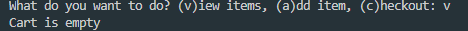
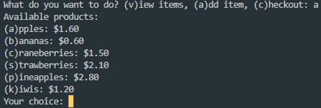
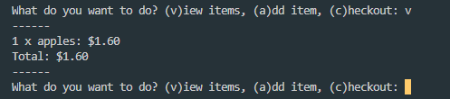
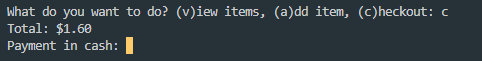
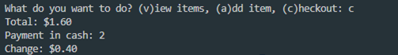
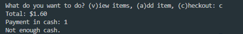

# shopping-cart-app

> Simple dart command line app

## Basic functionalities of this app:

```bash
User will be prompted to type:
v to view items,
a to add items,
c to checkout
```

```bash

Choosing v lets user see items in the cart
```

```bash
Choosing a would let user select item to add into cart
```

```bash
User can select 1st letter of fruit to add to cart e.g. a,b

Choosing v again would let user see items in the cart
```

```bash
Choosing c would let the user make payment
```

```bash
if sufficient cash is presented, the program exits
```

```bash
else the program returns a message that the cash is not sufficient and continues
```

```bash
```

## Environment setup (to run this locally)

```bash
# Install the dart sdk
1.Install the sdk either via cli or manually
https://dart.dev/get-dart

2.add the sdk location to your PATH

```

## Build Setup

```bash

# install dependencies (on windows)
$ dart pub get

# run the app in the root folder of the downloaded project
$ dart bin/main.dart

```

